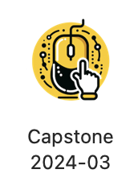

# 2024 capstone 03

[](https://github.com/kookmin-sw/capstone-2024-03/actions/workflows/python-package.yml)
[](https://github.com/kookmin-sw/capstone-2024-03/actions/workflows/node.js.yml)


본 프로젝트는 Python 3.10, 3.11, 3.12 / NodeJS 18, 20 버전의 CI/CD 테스트를 진행하고 있습니다.

## 프로젝트 소개

사용자가 작성한 자동화 시나리오에 따라 스마트폰 제어하여 반복업무를 대신 수행하며 생산성을 높이고, 창의적인 업무에 매진할 수 있게 돕는다.

이 때 시나리오 작성은 코드가 아닌 유저 친화적인 양식(Form)과 끌어놓기 (Drag and Drop) 기능을 지원하여 누구나 사용할 수 있는 범용성을 가진다.

## Abstract

Automation scenarios are created by users and controlled by android to take over repetitive tasks (operator), increasing productivity.

Scenario creation is user-friendly forms and drag & drop functionality rather than coding, making it universal to everyone.

## 영상

* 캡스톤 디자인 2024 03팀 중간 발표

[](https://www.youtube.com/watch?v=0gcAZPV-hl8)

## 팀 소개

|이름|프로필 사진 | 역할 | 깃허브|
| - | - | - | - | 
| **신민욱 (\*\*\*\*1640 )** |  | 서버, 클라이언트, 문서, 테스트 | [https://github.com/minwook-shin](https://github.com/minwook-shin) | 
| **임덕규 (산학 멘토)** |  | 프로젝트 멘토링 | [https://github.com/RavenKyu](https://github.com/RavenKyu) |

## 개발 환경 설정 및 사용법

해당 프로젝트의 시작을 위해서 서버의 환경 설정을 먼저 진행해주셔야 합니다.

### 서버

#### macOS

1. 파이썬 3.10 ~ 3.12 설치:

```bash
brew install python@3.12
```

2. 가상환경 생성:

```bash
python3 -m venv .venv
source venv/bin/activate
```

#### Linux

1. 파이썬 3.10 ~ 3.12 설치:

```bash
sudo apt-get install python3.12
```

2. 가상환경 생성:

```bash
python3 -m venv venv
source venv/bin/activate
```

#### 모든 플랫폼

```bash
pip install -r apps/requirements.txt 
```

### 클라이언트

#### Windows

1. Node.js 개발환경 구축:

[Node.js 공식 웹사이트](https://nodejs.org/en/download/)에서 Node.js를 내려받고 설치

#### macOS

1. Node.js 개발환경 구축:

```bash
brew install node
```

#### Linux

1. Node.js 개발환경 구축:

```bash
sudo apt-get install nodejs
```

#### 모든 플랫폼

```bash
npm install
npm run dev
```

## 실기기의 ADB USB 디버깅 설정

1. 안드로이드의 설정 메뉴로 이동합니다.

2. "개발자 옵션"으로 이동한 후, "USB 디버깅" 옵션을 찾아서 활성화합니다.

3. 컴퓨터와 기기를 USB 케이블로 연결합니다.

4. (optional) 사전 패키징된 adb 바이너리를 설치합니다.

* MacOS, Linux

```bash
sh ./scripts/adb_installer.sh
npm run adb-start
```

* Windows

```powershell
powershell -noexit "& ""scripts\adb_installer.ps1"""
npm run adb-start
```

## 빌드 및 사용법

React, Electron 빌드를 완료하면, 다음과 같이 어플리케이션이 생성됩니다 : 



# Related Library

## Python PYPI Release

해당 프로젝트를 진행하면서 아래 라이브러리를 제작하였으며, 지속 관리를 위하여 각자 분리된 오픈소스 패키지로 CI/CD 및 자동 배포를 진행할 수 있도록 구축하였습니다.

* easy-adb : 안드로이드 디버그 브릿지 서버를 쉽게 구동하기 위한 패키지
    * https://pypi.org/project/easy-adb/

* f-scheduler : 파이썬 함수를 원하는 순서대로 실행하기 위한 스케줄러 패키지
    * https://pypi.org/project/f-scheduler/

* q-logger-py : 표준 라이브러리보다 빠르고 쓰레드 지향적인 로거 패키지
    * https://pypi.org/project/q-logger-py/

* image-finder: 터미널에서만 동작하는 OpenCV 기반 이미지 좌표 및 텍스트 추출하는 패키지
    * https://pypi.org/project/image-finder/

* flask-variable-manager: Flask 확장 어플리케이션으로 동작하는 변수 관리 프로젝트
    * https://pypi.org/project/flask-variable-manager/

## 문서

해당 프로젝트의 구조 및 API 설계에 대한 내용은 [위키](https://github.com/kookmin-sw/capstone-2024-03/wiki) 를 참고해주세요.
